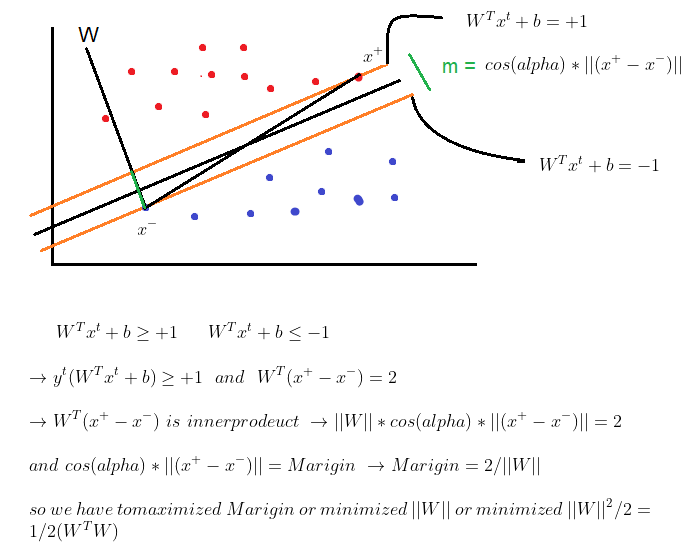
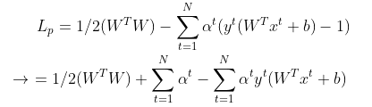
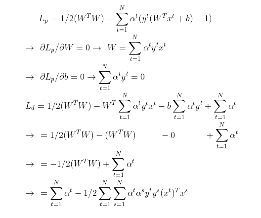

# SVM

Super Vector Machine goal is maximize marigin for having better classifier

so we have and objective function and N(number of data) statements that have to satisfied

so we can  put statements in objective function :

so we have to compute the derivative of Lp with respect to W and b and replace them in Lp to have Ld

after we have an optimizing problem and we can solve it by gradient descent, smo algorithm or even genetic
